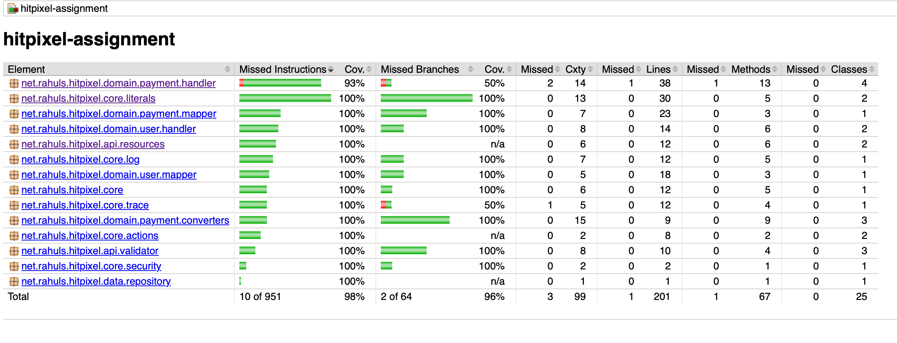

### HITPIXEL ASSIGNMENT

#### How to run
1. With external database
```
docker compose up -d
```

2. With Embedded DB for development 
```
# Generate signing key
openssl rand -hex 64

mvn spring-boot:run -Dspring.profiles.active=local -DJWT_SIGNING_KEY=<your-signing-key>
```

#### Sample requests
1. Register User
```
curl -X POST --location "http://localhost:8080/api/users/register" \
    -H "Content-Type: application/json" \
    -d '{
          "username": "john.doe",
          "fullName": "John Doe",
          "email": "john.doe@test.com",
          "password": "Password@123"
        }'
```

2. Login
```
curl -X POST --location "http://localhost:8080/api/users/login" \
    -H "Content-Type: application/json" \
    -d '{
          "email": "john.doe@test.com",
          "password": "Password@123"
        }'
```

3. Add new transaction
```
curl -X POST --location "http://localhost:8080/api/payments" \
    -H "Authorization: Bearer {{authToken}}" \
    -H "Content-Type: application/json" \
    -d '{
          "amount": 100,
          "paymentMethod": "Credit Card",
          "currency": "USD"
        }'
```

4. Status of transaction
```
curl -X GET --location "http://localhost:8080/api/payments/1/status" \
    -H "Authorization: Bearer {{authToken}}"
```

5. Transaction history for user

```
curl -X GET --location "http://localhost:8080/api/payments/history" \
    -H "Authorization: Bearer {{authToken}}"
```

6. Refund
```
curl -X POST --location "http://localhost:8080/api/payments/1/refund" \
    -H "Authorization: Bearer {{authToken}}"
```
#### Junit Coverage
